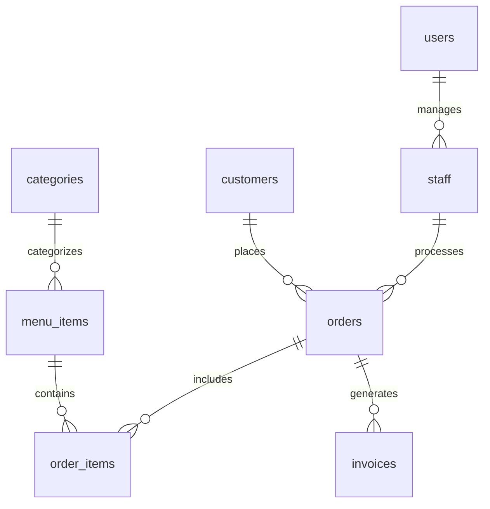

# MySQL Database Setup for React Admin Dashboard

## 🗄️ Database Overview

This MySQL database is designed for a comprehensive restaurant/admin dashboard application with the following features:

- **User Authentication & Authorization**
- **Staff Management**
- **Customer Management**
- **Menu & Inventory Management**
- **Order Processing**
- **Sales & Reporting**
- **Invoice Management**

## 📋 Prerequisites

1. **MySQL Server** (version 8.0 or higher)
2. **Node.js** (version 16 or higher)
3. **npm** or **yarn**

## 🚀 Quick Setup

### 1. Install MySQL Server

**Windows:**
- Download MySQL Installer from [mysql.com](https://dev.mysql.com/downloads/installer/)
- Run the installer and follow the setup wizard
- Remember your root password!

**macOS:**
```bash
brew install mysql
brew services start mysql
```

**Linux (Ubuntu/Debian):**
```bash
sudo apt update
sudo apt install mysql-server
sudo mysql_secure_installation
```

### 2. Create Database

1. **Connect to MySQL:**
```bash
mysql -u root -p
```

2. **Run the schema file:**
```bash
source database/schema.sql;
```

3. **Verify database creation:**
```sql
SHOW DATABASES;
USE react_admin_db;
SHOW TABLES;
```

### 3. Configure Environment Variables

1. **Copy the example environment file:**
```bash
cp env.example .env
```

2. **Edit `.env` with your database credentials:**
```env
DB_HOST=localhost
DB_USER=root
DB_PASSWORD=your_actual_password
DB_NAME=react_admin_db
DB_PORT=3306
JWT_SECRET=your-super-secret-jwt-key
```

### 4. Install Backend Dependencies

```bash
cd server
npm install
```

### 5. Start the Backend Server

```bash
npm run dev
```

The server will start on `http://localhost:5000`

## 📊 Database Schema

### Core Tables

| Table | Purpose | Key Features |
|-------|---------|--------------|
| `users` | User authentication | JWT tokens, role-based access |
| `staff` | Employee management | HR data, performance tracking |
| `customers` | Customer database | CRM, order history |
| `menu_items` | Product catalog | Pricing, inventory, categories |
| `orders` | Order processing | Status tracking, payment |
| `invoices` | Billing system | Payment tracking |
| `sales` | Analytics | Daily/monthly reports |

### Relationships



## 🔐 Default Credentials

After running the schema, you can login with:

- **Username:** `admin`
- **Password:** `admin123`

## 🛠️ API Endpoints

### Authentication
- `POST /api/auth/login` - User login
- `POST /api/auth/register` - User registration
- `GET /api/auth/me` - Get current user profile
- `POST /api/auth/logout` - User logout

### Staff Management
- `GET /api/staff` - Get all staff
- `POST /api/staff` - Create new staff member
- `PUT /api/staff/:id` - Update staff member
- `DELETE /api/staff/:id` - Delete staff member

### Customer Management
- `GET /api/customers` - Get all customers
- `POST /api/customers` - Create new customer
- `PUT /api/customers/:id` - Update customer
- `DELETE /api/customers/:id` - Delete customer

### Menu Management
- `GET /api/menu` - Get all menu items
- `POST /api/menu` - Create new menu item
- `PUT /api/menu/:id` - Update menu item
- `DELETE /api/menu/:id` - Delete menu item

### Order Management
- `GET /api/orders` - Get all orders
- `POST /api/orders` - Create new order
- `PUT /api/orders/:id/status` - Update order status

### Reports
- `GET /api/reports/sales` - Sales reports
- `GET /api/reports/customers` - Customer analytics
- `GET /api/reports/inventory` - Inventory status

## 🔧 Database Maintenance

### Backup Database
```bash
mysqldump -u root -p react_admin_db > backup_$(date +%Y%m%d_%H%M%S).sql
```

### Restore Database
```bash
mysql -u root -p react_admin_db < backup_file.sql
```

### Reset Database
```bash
mysql -u root -p
DROP DATABASE react_admin_db;
CREATE DATABASE react_admin_db;
USE react_admin_db;
source database/schema.sql;
```

## 📈 Sample Queries

### Get Daily Sales Report
```sql
SELECT 
    DATE(order_date) as date,
    COUNT(*) as total_orders,
    SUM(total_amount) as total_revenue
FROM orders 
WHERE DATE(order_date) = CURDATE()
AND order_status = 'delivered'
GROUP BY DATE(order_date);
```

### Get Top Selling Items
```sql
SELECT 
    mi.name,
    SUM(oi.quantity) as total_sold,
    SUM(oi.total_price) as total_revenue
FROM order_items oi
JOIN menu_items mi ON oi.menu_item_id = mi.id
JOIN orders o ON oi.order_id = o.id
WHERE o.order_status = 'delivered'
GROUP BY mi.id
ORDER BY total_sold DESC
LIMIT 10;
```

### Get Customer Order History
```sql
SELECT 
    c.first_name,
    c.last_name,
    COUNT(o.id) as total_orders,
    SUM(o.total_amount) as total_spent
FROM customers c
LEFT JOIN orders o ON c.id = o.customer_id
WHERE c.is_active = TRUE
GROUP BY c.id
ORDER BY total_spent DESC;
```

## 🚨 Security Considerations

1. **Change default passwords** immediately after setup
2. **Use strong JWT secrets** in production
3. **Enable SSL** for database connections in production
4. **Regular backups** of your database
5. **Monitor database performance** and optimize queries
6. **Implement proper access controls** and user roles

## 🐛 Troubleshooting

### Common Issues

1. **Connection Refused**
   - Check if MySQL service is running
   - Verify port number (default: 3306)
   - Check firewall settings

2. **Access Denied**
   - Verify username and password
   - Check user privileges
   - Ensure database exists

3. **Performance Issues**
   - Check indexes on frequently queried columns
   - Monitor slow query log
   - Optimize database configuration

### Useful Commands

```sql
-- Check MySQL status
SHOW PROCESSLIST;

-- Check database size
SELECT 
    table_schema AS 'Database',
    ROUND(SUM(data_length + index_length) / 1024 / 1024, 2) AS 'Size (MB)'
FROM information_schema.tables 
WHERE table_schema = 'react_admin_db'
GROUP BY table_schema;

-- Check table sizes
SELECT 
    table_name AS 'Table',
    ROUND(((data_length + index_length) / 1024 / 1024), 2) AS 'Size (MB)'
FROM information_schema.tables 
WHERE table_schema = 'react_admin_db'
ORDER BY (data_length + index_length) DESC;
```

## 📞 Support

If you encounter any issues:

1. Check the error logs in the console
2. Verify database connection settings
3. Ensure all dependencies are installed
4. Check MySQL server status

For additional help, refer to the MySQL documentation or create an issue in the project repository. 